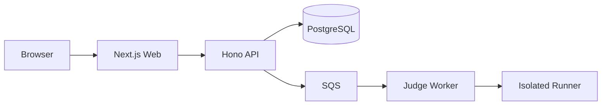

# DevArena Architecture

## Phase 1 foundation

DevArena is a pnpm monorepo containing independently deployable applications and shared contracts.

Phase 1 implements only the application shells. PostgreSQL, SQS, and sandbox execution are deliberately deferred.

## Boundaries

- `apps/web`: browser-facing presentation and interaction.
- `apps/api`: HTTP transport, future authentication, validation and domain services.
- `apps/judge-worker`: asynchronous execution worker; no HTTP responsibility.
- `packages/api-contracts`: environment-neutral API DTOs/schemas.
- `packages/config`: server-side configuration validation.
- `packages/shared`: environment-neutral shared primitives.

Server-only dependencies must never be imported into browser bundles.

## Phase 1 invariants

1. No submitted source code is executed by the API.
2. No production data is hardcoded into frontend code.
3. Shared packages contain no secrets or server credentials.
4. Strict TypeScript is enabled.
5. Each deployable application has its own build boundary.
